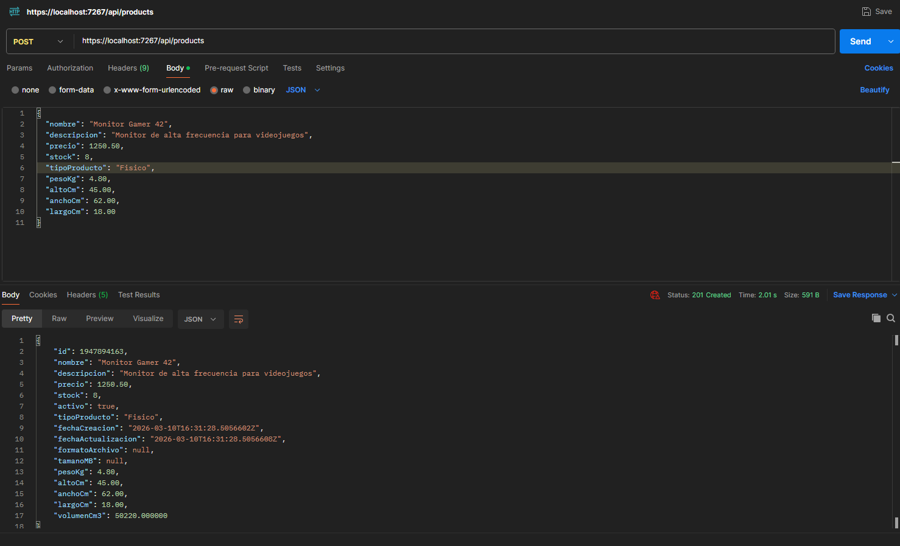
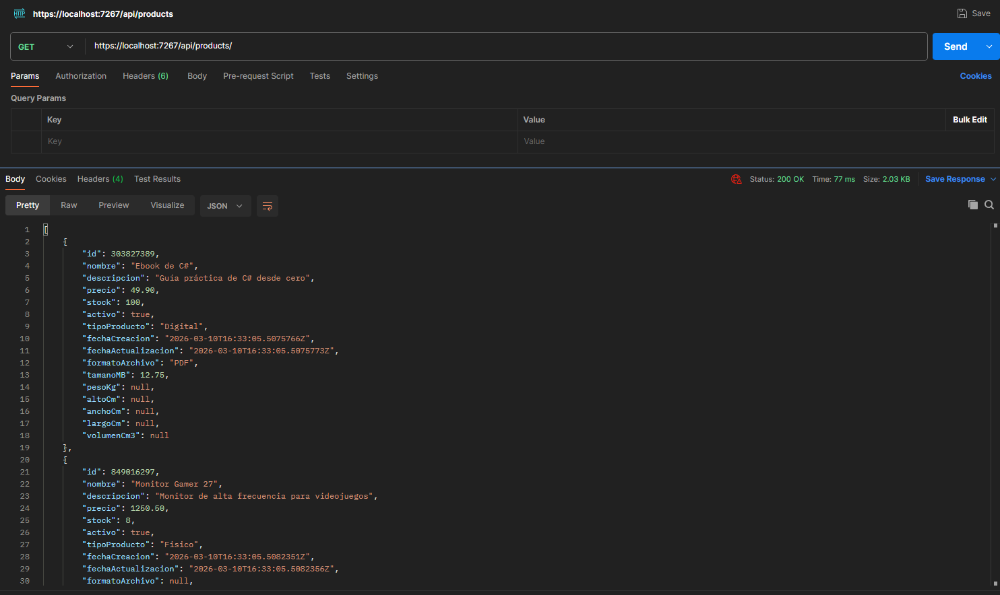
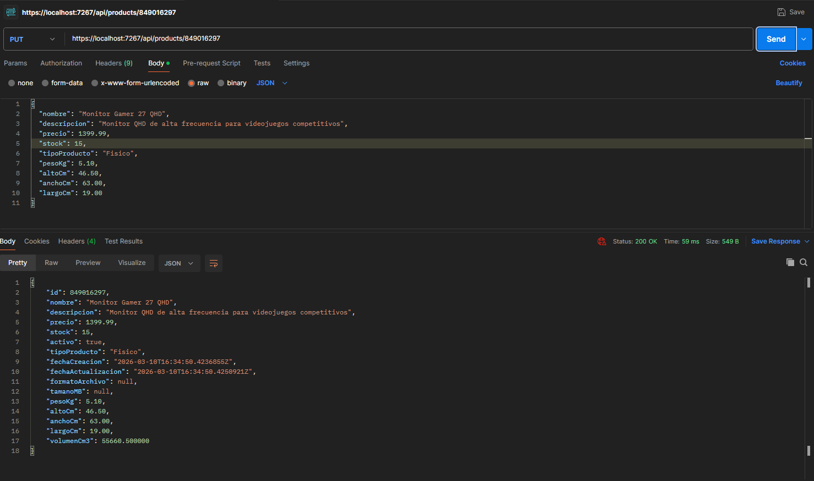
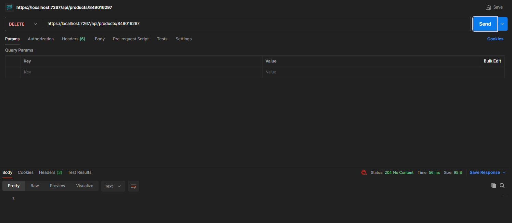

# Plataforma e-Commerce - Estado actual de la solución y material histórico

## Estado actual del proyecto

La solución abierta en esta rama representa una plataforma e-commerce en consolidación arquitectónica sobre `.NET 10`, organizada en los proyectos `Web`, `Application`, `Domain`, `Infrastructure` y `Tests`.

### Arquitectura vigente

- `Web` actúa como composición raíz y superficie HTTP basada principalmente en `Razor Pages`, con controladores API complementarios.
- `Application` expone la frontera pública de casos de uso mediante interfaces `I*ApplicationService` e implementaciones `*ApplicationService`.
- `Domain` concentra entidades, agregados, value objects, reglas de negocio y eventos de dominio.
- `Infrastructure` implementa persistencia, seguridad, auditoría y demás adaptadores técnicos requeridos por `Application`.

### Convención arquitectónica activa de Fase 0

- La dirección oficial de dependencias es `Web -> Application -> Domain`.
- `Infrastructure` implementa contratos de `Application`; no expone comportamiento de negocio directamente a `Web`.
- La única forma oficial de entrar a un caso de uso es mediante interfaces `I*ApplicationService` e implementaciones `*ApplicationService`.
- `Commands`, `Queries`, `Validators` y `Mappings` se consideran modelos y mecanismos internos de `Application`, no una arquitectura pública competidora.

### Estado documental del repositorio

El resto de este `README` conserva trazabilidad de etapas académicas anteriores del repositorio. Ese material sigue siendo útil como historial formativo, pero no reemplaza la convención arquitectónica vigente ni describe por sí solo la solución activa.

### Estado comercial-operativo vigente

- Versión base actual: `1.5.0+fase5`.
- Estrategia de despliegue actual: instancia monocliente configurable mediante `ClientExperience`.
- Branding configurable en storefront y backoffice sin introducir multi-tenant completo.
- Backoffice con dashboard operativo, auditoría transversal y centro de operación/soporte.
- Health checks disponibles en `/health/live` y `/health/ready`.

### Guías actuales de instalación, operación y soporte

- `docs/INSTALLATION.md`
- `docs/OPERATIONS.md`
- `docs/SUPPORT.md`
- `CHANGELOG.md`

## 1. Descripción General del Historial del Proyecto
Este repositorio integra el desarrollo de varias asignaciones académicas correspondientes a diferentes materias del programa.
La solución evolucionó desde ejercicios iniciales de Programación Orientada a Objetos hasta una base arquitectónica multicapa con backend, capa web, persistencia y pruebas automatizadas.

# PARTE I
> Nota: las secciones siguientes documentan la evolución académica del repositorio y deben leerse como historial de construcción, no como especificación única de la arquitectura vigente.

## Asignación No. 2 – Implementación de Clases Básicas (POO)
## 2. Objetivo Académico
Aplicar los principios fundamentales de la Programación Orientada a Objetos mediante:
- Definición de clases y objetos
- Encapsulación
- Uso de propiedades (get/set)
- Implementación de constructores
- Manejo de colecciones (List<T>)
- Separación de responsabilidades

## 3. Tecnologías Utilizadas (Asignación 2)
- Lenguaje: C#
- Framework: .NET
- Entorno: Visual Studio 2026
- Control de versiones: Git
- Repositorio remoto: GitHub

## 4. Estructura del Proyecto (POO)
/PlataformaECommerce
│
├── Dominio
│   ├── Producto.cs
│   ├── Usuario.cs
│   ├── CarritoCompra.cs
│
├── Program.cs
└── README.md

## 5. Implementación de Clases
### Clase Producto
Representa los artículos disponibles para la venta.

Atributos:
- Id
- Nombre
- Descripción
- Precio
- Stock

Funcionalidades:
- Constructor parametrizado
- Validación para evitar valores negativos
- Propiedades encapsuladas

### Clase Usuario
Modela la información básica del cliente.

Atributos:
- Id
- Nombre
- Correo electrónico
- Contraseña

Funcionalidades:
- Constructor de inicialización
- Métodos de actualización
- Destructor opcional con fines académicos

### Clase CarritoCompra
Representa la colección de productos seleccionados por el usuario.

Atributos:
- Lista de productos
- Total calculado dinámicamente

Métodos:
- AgregarProducto()
- RemoverProducto()
- CalcularTotal()

## 6. Funcionamiento (POO)
En Program.cs se realiza una simulación que:
1. Crea productos.
2. Instancia un carrito.
3. Agrega y elimina productos.
4. Calcula el total final.

## 7. Desafíos Encontrados (Asignación 2)
- Separación correcta de responsabilidades.
- Cálculo dinámico del total dentro de la clase correspondiente.
- Manejo adecuado de colecciones.

## Asignación No. 3 (POO) – Extensión de Funcionalidades mediante Herencia
## 8. Objetivo Académico (Herencia)
Extender el modelo de dominio e-Commerce aplicando herencia para:
- Generalizar funcionalidades comunes en clases base.
- Especializar comportamientos y atributos en clases derivadas.
- Evidenciar polimorfismo al manipular objetos derivados mediante referencias a clases base.

La implementación se realizó de manera conceptual (sin base de datos), priorizando buenas prácticas de diseño orientado a dominio y código profesional con validaciones.

## 9. Tecnologías Utilizadas (Asignación 3 - POO Herencia)
- Lenguaje: C#
- Framework: .NET
- Entorno: Visual Studio 2026
- Control de versiones: Git
- Repositorio remoto: GitHub

## 10. Estructura del Dominio (Actualizada con Herencia)
/PlataformaECommerce
│
├── Dominio
│   ├── Producto.cs                (Clase base abstracta)
│   ├── ProductoDigital.cs         (Derivada)
│   ├── ProductoFisico.cs          (Derivada)
│   ├── Usuario.cs                 (Clase base abstracta)
│   ├── Cliente.cs                 (Derivada)
│   ├── Administrador.cs           (Derivada)
│   ├── CarritoCompra.cs           (Soporta polimorfismo con List<Producto>)
│
├── Program.cs                     (Demo completa Asignación 3 - Herencia)
└── README.md

## 11. Herencia aplicada en Productos
### 11.1 Producto (Clase base abstracta)
La clase Producto se convirtió en abstracta para representar el comportamiento común del catálogo:
- Id, Nombre, Descripción, Precio, Stock
- Métodos de negocio: AumentarStock(), DisminuirStock(), ActualizarPrecio()
- Método virtual: ObtenerDescripcionDetallada()

Este enfoque permite reutilización de código y asegura que los productos concretos se creen a través de clases derivadas.

### 11.2 ProductoDigital : Producto
Se implementó una clase derivada para productos descargables o digitales. Atributos adicionales:
- FormatoArchivo (ej: PDF, EPUB, MP4)
- TamanoMB

Incluye validaciones, constructor completo y sobrescritura de ObtenerDescripcionDetallada() para enriquecer la información mostrada.

### 11.3 ProductoFisico : Producto
Se implementó una clase derivada para productos que requieren logística. Atributos adicionales:
- PesoKg
- AltoCm, AnchoCm, LargoCm
- VolumenCm3 (cálculo útil para logística)

Incluye validaciones, constructor completo y sobrescritura de ObtenerDescripcionDetallada().

## 12. Herencia aplicada en Usuarios
### 12.1 Usuario (Clase base abstracta)
La clase Usuario se convirtió en abstracta para establecer un modelo profesional del dominio:
- Id, Nombre, Correo, Contraseña
- Método común: ActualizarDatos()
- Métodos virtuales: ObtenerRol(), MostrarPerfil()

Incluye validaciones de correo y contraseña (nota: en producción se usaría hash de contraseña).

### 12.2 Cliente : Usuario
Se implementó Cliente con atributos y métodos requeridos:
- HistorialCompras (List<int> con IDs de pedidos)
- Preferencias (HashSet<string> para evitar duplicados)
- Métodos: AgregarCompra(), VerHistorial(), AgregarPreferencia()

Se sobrescriben ObtenerRol() y MostrarPerfil() para demostrar polimorfismo.

### 12.3 Administrador : Usuario
Se implementó Administrador con capacidades de gestión:
- GestionarInventario(Producto producto, int nuevoStock)
- EstablecerPromocion(Producto producto, decimal porcentajeDescuento)

El enfoque es conceptual: sin BD, aplicando lógica y validaciones sobre objetos en memoria.

## 13. Polimorfismo evidenciado en CarritoCompra
CarritoCompra mantiene una colección List<Producto>, por lo cual puede almacenar:
- ProductoDigital
- ProductoFisico

Esto demuestra polimorfismo al operar sobre productos derivados mediante la clase base Producto, sin cambiar la lógica del carrito.

## 14. Cómo ejecutar la Demo (Asignación 3 - Herencia)
1. Clonar el repositorio:
   git clone URL_DEL_REPOSITORIO
2. Abrir la solución en Visual Studio.
3. Establecer el proyecto PlataformaECommerce como inicio.
4. Ejecutar (Ctrl + F5).
5. Tomar capturas en consola, especialmente de:
   - Creación de productos derivados
   - Creación de usuarios derivados
   - Carrito con productos digitales y físicos
   - Gestión de inventario y promoción por administrador
   - Preferencias e historial en cliente

## 15. Capturas (evidencia requerida)
Agrega aquí tus capturas en Markdown, por ejemplo:

### 15.1 Demo - Productos y Carrito

### 15.2 Demo - Administrador y Cliente

## 16. Desafíos Encontrados y Soluciones (Asignación 3 - Herencia)
1. **Conversión de clases base a abstract sin romper el proyecto**
   - Solución: se ajustó Program.cs para instanciar únicamente clases derivadas (ProductoDigital/ProductoFisico y Cliente/Administrador).

2. **Encapsulación y cambios de stock sin exponer setters públicos**
   - Solución: el Administrador gestiona stock usando métodos de negocio (AumentarStock/DisminuirStock) en lugar de modificar Stock directamente.

3. **Evitar duplicados en preferencias del cliente**
   - Solución: se usó HashSet<string> con comparación sin distinguir mayúsculas/minúsculas.

4. **Demostrar impacto de promociones en el total del carrito**
   - Solución: se aplicó descuento con EstablecerPromocion() y se evidenció el cambio en el total mediante una operación controlada (remover y re-agregar).

# PARTE II
## Asignación No. 3 – Validador Dinámico del Lado del Cliente
## 17. Objetivo Académico
Desarrollar un formulario de registro de usuario con validaciones dinámicas en tiempo real utilizando JavaScript ES6+, integrándolo a una aplicación web construida con .NET Razor Pages.

El propósito es demostrar:
- Validación del lado del cliente
- Uso de módulos ES6
- Arquitectura limpia de JavaScript
- Retroalimentación instantánea al usuario
- Buenas prácticas modernas en desarrollo web

## 18. Tecnologías Utilizadas (Asignación 3)
- ASP.NET Core Razor Pages (.NET 8)
- JavaScript ES6 (módulos)
- Tailwind CSS (CDN)
- HTML5
- CSS moderno
- Git

## 19. Estructura Web del Proyecto
/PlataformaECommerce.Web
│
├── Pages
│   └── Registro
│       ├── Index.cshtml
│       └── Index.cshtml.cs
│
├── wwwroot
│   └── js
│       └── registro
│           ├── app.js
│           ├── reglas.js
│           ├── validadores.js
│           ├── utilidades.js
│           └── toast.js

## 20. Campos del Formulario
El formulario de registro incluye:
- Nombres
- Apellidos
- Correo electrónico
- Usuario (alias)
- Contraseña
- Confirmación de contraseña
- Fecha de nacimiento
- Edad (calculada automáticamente)
- Teléfono (opcional)
- Aceptación de términos

## 21. Validaciones Implementadas
Campo:				Validaciones Aplicadas
Nombres:			Obligatorio, mínimo 2 caracteres, solo letras
Apellidos:			Obligatorio, mínimo 2 caracteres, solo letras
Correo:				Formato válido + simulación async de “ya registrado”
Usuario:			4–16 caracteres, sin espacios, letras/números/_ .
Contraseña:			Mínimo 8, mayúscula, número y símbolo
Confirmación:		Debe coincidir con contraseña
Fecha nacimiento:	No futura, mayor o igual a 18 años
Edad:				Calculada automáticamente
Teléfono:			Opcional, 10 dígitos
Términos:			Obligatorio

## 22. Funcionalidades Dinámicas Implementadas
- Validación en tiempo real (input, blur, change)
- Motor de reglas centralizadas
- Arquitectura modular ES6
- Separación UI vs lógica
- Barra de fortaleza de contraseña
- Edad calculada automáticamente
- Resumen de errores
- Toast dinámico tipo SaaS
- Estado de carga en botón "Registrar"

## 23. Arquitectura JavaScript
El sistema de validación fue estructurado bajo principios de separación de responsabilidades:
- utilidades.js → funciones auxiliares
- validadores.js → reglas individuales
- reglas.js → configuración centralizada por campo
- ui.js → manipulación visual
- app.js → orquestador principal
- toast.js → sistema de notificaciones
Esta estructura facilita mantenimiento y escalabilidad.

## 24. Integración con el Proyecto OOP
Aunque el validador funciona del lado del cliente, su diseño está preparado para integrarse con el modelo de dominio desarrollado en la Asignación 2.
La arquitectura permite que el formulario pueda enviar posteriormente datos hacia una API REST basada en las clases Usuario y CarritoCompra.

## 25. Desafíos Encontrados (Asignación 3)
1. Separar la lógica de validación de la manipulación visual.
2. Implementar validación asíncrona simulada sin bloquear la interfaz.
3. Calcular la edad dinámicamente evitando manipulación manual.
4. Diseñar una arquitectura modular limpia con ES6.
Las soluciones aplicadas permitieron construir un sistema mantenible, escalable y profesional.

## 26. Cómo Ejecutar el Proyecto
### Parte Consola (Asignación 2)
1. Clonar el repositorio:
	git clone URL_DEL_REPOSITORIO
2. Abrir en Visual Studio.
3. Ejecutar PlataformaECommerce.

### Parte Web (Asignación 3)
1. Abrir solución en Visual Studio.
2. Establecer PlataformaECommerce.Web como proyecto de inicio.
3. Ejecutar.
4. Navegar a:
	https://localhost:PUERTO/Registro
	
## 27. Conclusión Académica
El proyecto demuestra la aplicación práctica de:
- Principios de Programación Orientada a Objetos.
- Desarrollo de interfaces web modernas.
- Validación dinámica del lado del cliente.
- Buenas prácticas de arquitectura en JavaScript.
- Separación de responsabilidades.
- Diseño profesional de experiencia de usuario.
La integración entre backend estructural (POO) y frontend dinámico (ES6) permite comprender la arquitectura completa de una aplicación web moderna.

## 28. Autor
Nombre del estudiante: Emerson Andrey Rodríguez Rincón
Curso: Programación Orientada a Objetos / Programming the Internet
Asignación No. 2 y Asignación No. 3
Año: 2026

# PARTE III
## Asignación No. 5 – Desarrollo del Backend de la Plataforma e-Commerce
## 29. Objetivo Académico
Esta asignación tiene como objetivo diseñar e implementar el backend de la plataforma e-Commerce utilizando una arquitectura profesional basada en capas y principios de diseño modernos.

El sistema expone una API REST que permite gestionar productos del catálogo mediante operaciones CRUD (Crear, Leer, Actualizar y Eliminar), integrando múltiples tecnologías de almacenamiento y aplicando buenas prácticas de ingeniería de software.

Los principales objetivos técnicos fueron:
- Diseñar una arquitectura escalable basada en Domain Driven Design (DDD).
- Implementar una API REST profesional en .NET.
- Integrar bases de datos SQL y NoSQL.
- Aplicar separación de responsabilidades mediante capas.
- Implementar validación y manejo de errores en el API.

## 30. Tecnologías Utilizadas (Asignación 5)
Backend
- .NET 8
- ASP.NET Core Web API
- C#
- Entity Framework Core

Bases de datos
- SQL Server (Base de datos relacional)
- MongoDB (auditoría de operaciones)

Arquitectura
- Domain Driven Design (DDD)
- Clean Architecture
- Repository Pattern
- Unit of Work
- Herramientas
- Visual Studio
- Postman
- Git
- GitHub

## 31. Arquitectura del Sistema
La solución fue estructurada en múltiples capas siguiendo principios de arquitectura limpia.

/PlataformaECommerce
│
├── PlataformaECommerce.Domain
│   ├── Entities
│   │   ├── Producto.cs
│   │   ├── ProductoDigital.cs
│   │   ├── ProductoFisico.cs
│   │   ├── Usuario.cs
│   │   ├── Cliente.cs
│   │   ├── Administrador.cs
│   │   └── CarritoCompra.cs
│
├── PlataformaECommerce.Application
│   ├── DTOs
│   ├── Interfaces
│   └── Services
│
├── PlataformaECommerce.Infrastructure
│   ├── Persistence
│   │   ├── ECommerceDbContext.cs
│   │   ├── Configurations
│   │   └── Entities
│   ├── Repositories
│   └── UnitOfWork
│
├── PlataformaECommerce.Web
│   ├── Controllers
│   │   └── ProductsController.cs
│   └── Middlewares
│       └── ExceptionHandlingMiddleware.cs

Esta arquitectura permite separar claramente:
- Dominio del negocio
- Lógica de aplicación
- Infraestructura de datos
- API web

## 32. Base de Datos SQL
El sistema utiliza SQL Server como base de datos relacional para almacenar la información principal del catálogo de productos.

Entity Framework Core fue utilizado como ORM para mapear las entidades del dominio hacia tablas relacionales.

La tabla principal implementada es:
Productos

Campos principales:
- Id
- Nombre
- Descripcion
- Precio
- Stock
- TipoProducto
- FormatoArchivo
- TamanoMB
- PesoKg
- AltoCm
- AnchoCm
- LargoCm
- FechaCreacion
- FechaActualizacion

La base de datos es creada mediante migraciones de Entity Framework Core, garantizando control de versiones del esquema.

## 33. Integración con Base de Datos NoSQL
Para complementar el almacenamiento relacional, el sistema implementa una base de datos MongoDB destinada a registrar auditoría de operaciones.

Cada vez que se crea o actualiza un producto, se registra un evento en MongoDB con información como:
- Tipo de operación
- Identificador del producto
- Fecha de ejecución
- Datos relevantes de la operación

Este enfoque permite separar:
- datos transaccionales → SQL Server
- datos de auditoría y eventos → MongoDB

Una práctica común en arquitecturas modernas basadas en microservicios.

## 34. API REST Implementada
La API REST expone endpoints para la gestión de productos.

Endpoints principales:

Método		Endpoint			Descripción
GET			/api/products		Obtener todos los productos
GET			/api/products/{id}	Obtener un producto por id
POST		/api/products		Crear un producto
PUT			/api/products/{id}	Actualizar un producto
DELETE		/api/products/{id}	Eliminar un producto

Todos los endpoints fueron probados exitosamente mediante Postman.

## 35. Validación y Manejo de Errores
La API implementa validación robusta mediante:
- DataAnnotations en DTOs
- Validación automática con [ApiController]
- Middleware global de manejo de excepciones

Esto permite devolver respuestas HTTP claras y consistentes.

Ejemplo de respuesta de error:

{
  "mensaje": "La solicitud contiene errores de validación",
  "errores": {
    "Nombre": [
      "El nombre del producto es obligatorio"
    ]
  }
}

## 36. Evidencia de Funcionamiento
A continuación se presentan capturas de las pruebas realizadas con Postman.

Creación de producto

Obtener productos

Actualizar producto

Eliminación de producto

## 37. Desafíos Encontrados y Soluciones
Durante el desarrollo del backend se presentaron diversos retos técnicos.

### Separación correcta de capas
Se solucionó mediante una arquitectura basada en Domain, Application, Infrastructure y Web.

### Persistencia híbrida SQL + NoSQL
Se diseñó una estrategia donde SQL Server gestiona datos transaccionales y MongoDB almacena auditoría.

### Manejo centralizado de errores
Se implementó un middleware global para capturar excepciones y devolver respuestas estructuradas.

### Validación robusta de datos
Se aplicaron DataAnnotations en DTOs y validación automática del framework ASP.NET Core.

## 38. Cómo Ejecutar el Backend

1. Clonar el repositorio
	git clone URL_DEL_REPOSITORIO
2. Abrir la solución en Visual Studio
3. Configurar secretos locales de desarrollo
    - Copiar `PlataformaECommerce.Web/appsettings.Development.local.example.json` a `PlataformaECommerce.Web/appsettings.Development.local.json`.
    - Completar `ConnectionStrings:DefaultConnection` y `Jwt:SigningKey` con valores reales del entorno local.
    - Opcionalmente, configurar `MongoDb:ConnectionString` y establecer `MongoDb:Enabled=true` si se desea auditoría MongoDB en desarrollo.
4. Ejecutar migraciones
	Update-Database
5. Ejecutar el proyecto
6. Probar endpoints con Postman

## 39. Conclusión Académica
La implementación del backend permitió aplicar conceptos avanzados de ingeniería de software, incluyendo arquitectura por capas, integración de bases de datos relacionales y NoSQL, diseño de APIs REST y manejo robusto de validaciones y errores.

El resultado es una plataforma e-Commerce estructurada de forma profesional, preparada para escalar hacia implementaciones reales en entornos productivos.

## 40. Autor
Nombre del estudiante: Emerson Andrey Rodríguez Rincón
Curso: Programming the Internet
Asignación No. 5 – Backend e-Commerce API
Año: 2026

# PARTE IV
## Asignación No. 7 – Implementación de Patrones de Diseño
## 41. Objetivo Académico
Esta asignación tiene como objetivo aplicar patrones de diseño clásicos para mejorar la arquitectura del sistema e-Commerce, promoviendo reutilización de código, desacoplamiento entre componentes y mayor escalabilidad del software.
Los patrones implementados fueron:
- Singleton
- Factory
- Observer

Estos patrones permiten resolver problemas comunes de diseño relacionados con:
- Gestión centralizada de configuraciones
- Creación controlada de objetos
- Notificación de eventos dentro del sistema

La implementación fue integrada completamente dentro de la arquitectura existente basada en Domain Driven Design (DDD) y Clean Architecture, respetando la separación de responsabilidades entre capas.

## 42. Tecnologías Utilizadas (Asignación 7)
Lenguaje: C#
Framework: .NET 8
Arquitectura: 
- Clean Architecture
- Domain Driven Design (DDD)
Patrones de diseño:
- Singleton Pattern
- Factory Pattern
- Observer Pattern
Herramientas:
- Visual Studio
- Git
- GitHub

## 43. Integración de los Patrones en la Arquitectura
Los patrones de diseño fueron integrados respetando la arquitectura por capas del sistema.

/PlataformaECommerce
│
├── PlataformaECommerce.Domain
│   └── Entities
│
├── PlataformaECommerce.Application
│   └── Services / Interfaces
│
├── PlataformaECommerce.Infrastructure
│   ├── Settings
│   │   └── ConfiguracionSistema.cs        (Singleton)
│   │
│   ├── Factories
│   │   └── FabricaEntidades.cs            (Factory)
│   │
│   └── Observers
│       ├── IObservador.cs
│       ├── ISujeto.cs
│       ├── NotificadorEventos.cs
│       ├── ObservadorUI.cs
│       ├── ObservadorInventario.cs
│       └── ObservadorLogs.cs
│
├── PlataformaECommerce.Web
│
└── PlataformaECommerce.ConsoleDemo
    └── Program.cs (Demostración de los patrones)

La capa Infrastructure contiene las implementaciones técnicas de los patrones, mientras que las entidades del dominio permanecen independientes.

## 44. Implementación del Patrón Singleton
Durante una fase académica anterior se utilizó un enfoque Singleton para modelar configuración global.

Sin embargo, la solución vigente ya no utiliza la clase `ConfiguracionSistema` ni estado global mutable dentro de `Infrastructure`.
La configuración actual se resuelve mediante opciones tipadas, inyección de dependencias y validación al arranque, alineándose mejor con la arquitectura vigente:

- `Web -> Application -> Domain`
- `Infrastructure` como implementación de puertos técnicos
- configuración registrada desde composición raíz

## 45. Implementación del Patrón Factory
El patrón Factory fue implementado mediante la clase FabricaEntidades, cuyo propósito es centralizar la creación de objetos del dominio.
Esto permite desacoplar la lógica de creación de entidades del resto del sistema.

### Funcionalidades principales
Creación de:
- Productos digitales
- Productos físicos
- Clientes
- Administradores

Ejemplo de uso:
	var ebook = FabricaEntidades.CrearProductoDigital(...);
	var mouse = FabricaEntidades.CrearProductoFisico(...);

	var cliente = FabricaEntidades.CrearCliente(...);
	var administrador = FabricaEntidades.CrearAdministrador(...);

Este enfoque permite:
- encapsular la lógica de instanciación
- evitar duplicación de código
- facilitar futuras extensiones del sistema

## 46. Implementación del Patrón Observer

El patrón Observer formó parte de una etapa académica previa para explorar mecanismos de notificación desacoplada.

En la solución vigente ese experimento fue retirado de `Infrastructure` porque no participaba del flujo real consumido por `Application`.
Actualmente la plataforma concentra sus mecanismos transversales activos en servicios de aplicación, repositorios y adaptadores técnicos realmente registrados en DI, especialmente para:

- persistencia SQL Server
- auditoría sobre MongoDB
- autenticación y contexto de ejecución

## 47. Nota sobre material histórico de demostración
Las demostraciones académicas asociadas a patrones exploratorios pertenecen a una etapa anterior del repositorio y no representan la solución activa abierta en esta rama.

La implementación vigente se centra en los proyectos actualmente integrados en la solución: `Web`, `Application`, `Domain`, `Infrastructure` y `Tests`.

## 48. Beneficios Arquitectónicos
La incorporación de estos patrones aporta múltiples ventajas al sistema:

### Desacoplamiento
En la solución vigente, el desacoplamiento se logra principalmente mediante contratos de `Application`, repositorios por interfaz y adaptadores técnicos en `Infrastructure`.

### Centralización
La configuración se centraliza desde la composición raíz usando opciones tipadas y registro de dependencias.

### Control de creación de objetos
El patrón Factory encapsula la lógica de instanciación de entidades del dominio.

### Escalabilidad
La arquitectura queda preparada para evolucionar hacia:
- Domain Events
- Event Driven Architecture
- Microservicios

## 49. Conclusión de la Asignación
La exploración académica de los patrones Singleton, Factory y Observer sirvió como base formativa para el proyecto.

Tras la consolidación arquitectónica posterior, la solución vigente conserva únicamente los componentes que siguen aportando valor al flujo real del sistema, priorizando una separación de capas consistente, menor acoplamiento y una composición basada en contratos.

## 50. Autor

Nombre del estudiante: Emerson Andrey Rodríguez Rincón
Curso: Programación Orientada a Objetos
Asignación No. 7 – Patrones de Diseño (Singleton, Factory y Observer)
Año: 2026

# PARTE V
## Asignación No. 8 – Manejo de Excepciones Personalizadas y Pruebas Unitarias
## 51. Objetivo Académico
El objetivo de esta asignación fue fortalecer la robustez del sistema e-Commerce mediante la implementación de un manejo estructurado de errores y la incorporación de pruebas unitarias automatizadas.

El desarrollo incluyó:
- Definición de una jerarquía profesional de excepciones personalizadas.
- Implementación de manejo de errores dentro de las entidades del dominio.
- Creación de pruebas unitarias utilizando el framework NUnit.
- Validación del comportamiento del sistema tanto en escenarios correctos como en situaciones de error.
Este enfoque permite mejorar la confiabilidad del software y facilita la detección temprana de fallos durante el proceso de desarrollo.

## 52. Tecnologías Utilizadas (Asignación 8)
Lenguaje: C#
Framework: .NET 10
Framework de pruebas: NUnit
Arquitectura:
- Domain Driven Design (DDD)
- Clean Architecture
Herramientas:
- Visual Studio
- Git
- GitHub

## 53. Implementación de Excepciones Personalizadas
Se diseñó una jerarquía de excepciones específica para el dominio e-Commerce con el objetivo de representar de manera clara los diferentes tipos de errores que pueden ocurrir dentro del sistema.

La estructura de excepciones se organizó de la siguiente manera:
Domain
 └── Exceptions
     ├── DomainException
     │
     ├── ProductException
     │   ├── InventarioInsuficienteException
     │   └── ProductoNoDisponibleException
     │
     ├── CartException
     │   └── CarritoVacioException
     │
     ├── UserException
     │   └── UsuarioNoValidoException
     │
     ├── PaymentException
     │   ├── PagoFallidoException
     │   └── MetodoPagoNoSoportadoException
     │
     ├── FactoryException
     │   └── EntidadNoSoportadaException

Este diseño permite:
- Clasificar errores por contexto de negocio.
- Manejar excepciones de manera más clara dentro del sistema.
- Facilitar el registro y diagnóstico de fallos.

## 54. Integración del Manejo de Excepciones en el Dominio
Las excepciones personalizadas fueron integradas dentro de las principales entidades del dominio para validar reglas de negocio críticas.

Ejemplos de validaciones implementadas:
Productos: 
- Validación de stock disponible antes de realizar operaciones.
- Prevención de actualización con valores inválidos.

Carrito de compras:
- Evitar operaciones sobre carritos inactivos.
- Evitar cálculos o pagos con carritos vacíos.

Usuarios:
- Validación de datos obligatorios en la creación y actualización de usuarios.

Este enfoque permite que las reglas de negocio sean protegidas directamente desde el dominio.

## 55. Implementación del Módulo de Pagos
La evolución posterior de la solución priorizó los módulos actualmente presentes en la arquitectura vigente: autenticación, usuarios, productos, carrito, pedidos, auditoría y dashboard administrativo.

Por ese motivo, los artefactos conceptuales no integrados al flujo real de la solución abierta fueron retirados o dejaron de documentarse como parte de la implementación vigente.

## 56. Implementación de Pruebas Unitarias
Se creó un proyecto independiente de pruebas:
- PlataformaECommerce.Tests
- Utilizando NUnit como framework de testing.

Estructura de pruebas:
PlataformaECommerce.Tests
│
├── Application
│   ├── Admin
│   ├── Audit
│   ├── Cart
│   ├── Orders
│   ├── Products
│   └── Users
│
├── Domain
│   ├── Cart
│   ├── Categories
│   ├── Common
│   ├── Orders
│   ├── Rules
│   ├── Usuarios
│   └── ValueObjects
│
├── Infrastructure
│   ├── Cart
│   ├── Factories
│   ├── Orders
│   ├── Security
│   └── Users
│
└── Web
    ├── Admin
    ├── Auth
    └── Controllers

Las pruebas verifican:
- funcionamiento correcto de las entidades
- manejo de excepciones
- validaciones del dominio
- comportamiento de servicios, mapeos, repositorios y entradas web activas

## 57. Tipos de Pruebas Implementadas
Las pruebas unitarias cubren diferentes escenarios:

### Pruebas funcionales
Validan el comportamiento esperado del sistema en condiciones normales.

Ejemplos:
- creación de productos
- cálculo de total del carrito
- consulta del dashboard administrativo

### Pruebas de validación

Verifican que el sistema rechace datos inválidos.
Ejemplos:
- creación de productos con datos incorrectos
- operaciones sobre carritos vacíos
- filtros inválidos de auditoría o consultas de aplicación

### Pruebas de excepciones
Comprueban que el sistema lance las excepciones correctas cuando ocurre un error.

Ejemplos:
- ProductoNoDisponibleException
- CarritoVacioException
- UsuarioNoValidoException
- EntidadNoSoportadaException

## 58. Beneficios del Testing Automatizado
La incorporación de pruebas unitarias aporta múltiples ventajas al proyecto:

Detección temprana de errores: Las pruebas permiten identificar fallos antes de que el sistema llegue a producción.

Mayor confiabilidad del software: El comportamiento del sistema puede validarse automáticamente en cada cambio del código.

Facilita mantenimiento: Los desarrolladores pueden modificar el sistema con mayor seguridad.

Base para integración continua: Las pruebas unitarias son un paso fundamental para implementar pipelines de CI/CD.

## 59. Ejecución de Pruebas
Para ejecutar las pruebas unitarias:
1. Abrir la solución en Visual Studio.
2. Compilar el proyecto.
3. Abrir el Test Explorer.
4. Ejecutar todas las pruebas.

Visual Studio mostrará el resultado de cada prueba indicando:
- pruebas exitosas
- pruebas fallidas
- tiempo de ejecución

## 60. Evidencia de Funcionamiento
Se recomienda incluir capturas del Test Explorer ejecutando las pruebas.

Ejemplo:
- Ejecución de pruebas unitarias

## 61. Conclusión de la Asignación

La implementación del manejo de excepciones personalizadas y pruebas unitarias permitió fortalecer significativamente la calidad del sistema e-Commerce.

Los principales logros fueron:
- Implementación de una jerarquía de excepciones orientada al dominio.
- Protección de reglas de negocio mediante validaciones robustas.
- Implementación de pruebas automatizadas con NUnit.
- Mejora de la confiabilidad y mantenibilidad del sistema.
Este enfoque refleja prácticas utilizadas en proyectos profesionales de desarrollo de software y hoy se integra con una solución organizada por capas `Web -> Application -> Domain`, con `Infrastructure` como soporte técnico de persistencia, seguridad y auditoría.

## 62. Autor
Nombre del estudiante: Emerson Andrey Rodríguez Rincón
Curso: Programación Orientada a Objetos
Asignación No. 8 – Manejo de Excepciones y Pruebas Unitarias
Año: 2026